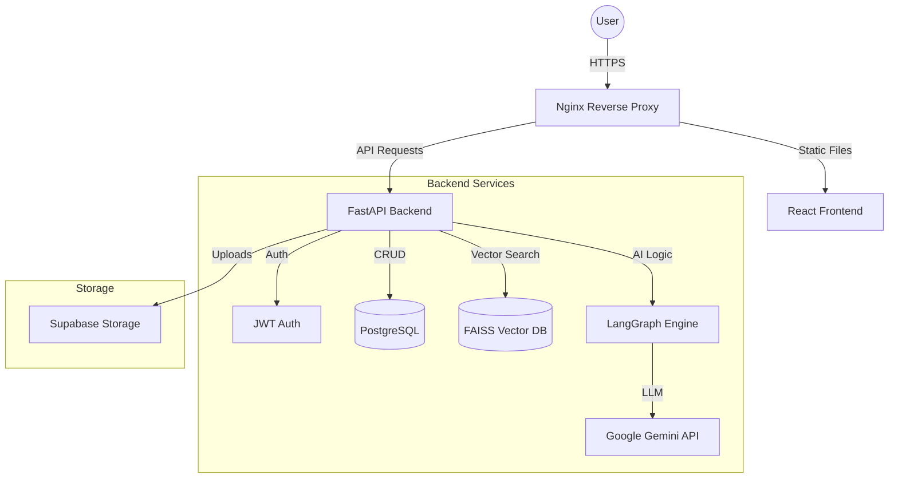
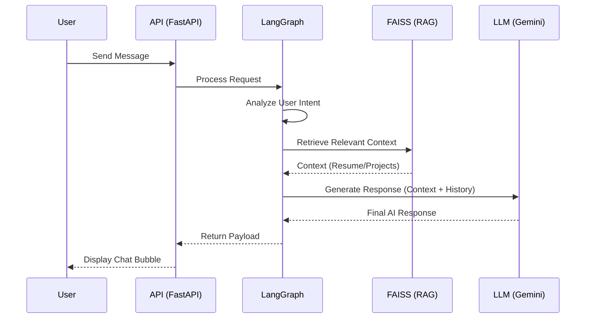
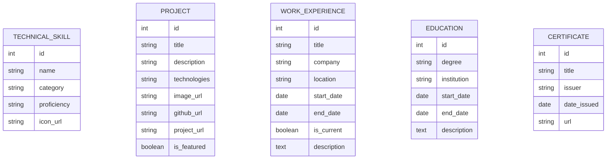
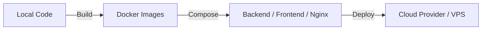

# 🚀 AI Portfolio Platform

<p align="center">
  
</p>

[](https://opensource.org/licenses/MIT)
[](https://fastapi.tiangolo.com/)
[](https://reactjs.org/)
[](https://www.docker.com/)
[](https://www.langchain.com/)

An enterprise-grade, open-source AI Portfolio Platform designed to showcase your professional journey with an intelligent, context-aware chatbot. This platform integrates a modern React frontend with a powerful FastAPI backend, leveraging advanced RAG (Retrieval-Augmented Generation) and LangGraph for sophisticated AI interactions.

---

## 🌟 Key Features

- **🤖 Intelligent AI Chatbot:** Powered by **LangGraph** and **Google Gemini**, providing context-aware responses based on your professional data.
- **📚 Advanced RAG Pipeline:** Uses **FAISS** for vector storage and **HuggingFace Embeddings** to retrieve relevant information from your resume and projects.
- **🛠️ Admin Dashboard:** A comprehensive CRUD interface to manage your Skills, Projects, Education, Experience, and Memorable Moments.
- **📁 Supabase Integration:** Seamless file and image uploads for your CV, project screenshots, and certificates.
- **🔒 Secure Authentication:** JWT-based security for the admin panel with environment-driven configuration.
- **🚀 Containerized Deployment:** Fully orchestrated with **Docker Compose** for easy setup and scaling.
- **📈 Real-time Analytics & Logs:** Integrated logging with **structlog** and real-time log streaming via WebSockets.

---

## 🏗️ System Architecture



---

## 🧠 AI Integration Flow

The chatbot uses a sophisticated multi-step process to ensure accurate and helpful responses.



---

## 📊 Database Schema



---

## 🚀 Deployment Workflow



---

## 📂 Project Structure

```text
ai-portfolio-platform/
├── backend/                # FastAPI Application
│   ├── ai_core/           # LangGraph & RAG Logic
│   ├── api/               # API Endpoints & Auth
│   ├── models/            # SQLAlchemy Models
│   └── services/          # Business Logic (File Uploads, etc.)
├── frontend/               # React Application (Vite)
│   ├── src/
│   │   ├── components/    # UI Components (Chat, Admin, Portfolio)
│   │   ├── pages/         # Page Views
│   │   └── services/      # API Integration
├── infrastructure/         # Deployment Configs
└── docker-compose.yml      # Orchestration
```

## 🛠️ Tech Stack

| Component | Technology |
| :--- | :--- |
| **Frontend** | React, TypeScript, Tailwind CSS, Vite, Lucide Icons |
| **Backend** | FastAPI, Python 3.12, Gunicorn, SQLAlchemy |
| **AI Core** | LangChain, LangGraph, Google Gemini, FAISS, HuggingFace |
| **Database** | PostgreSQL, Redis (Rate Limiting) |
| **Storage** | Supabase Storage |
| **DevOps** | Docker, Docker Compose, Nginx, Sentry |

---

## 🚦 Getting Started

### Prerequisites
- Docker & Docker Compose
- Google Gemini API Key
- Supabase Account (for storage)

### Installation

1. **Clone the Repo**
   ```bash
   git clone https://github.com/dagiteferi/ai-portfolio-platform.git
   cd ai-portfolio-platform
   ```

2. **Configure Environment**
   Create a `.env` file in the root:
   ```env
   # Database
   DATABASE_URL=postgresql://user:pass@db:5432/portfolio
   
   # AI
   GOOGLE_API_KEY=your_gemini_key
   
   # Supabase
   SUPABASE_URL=your_supabase_url
   SUPABASE_KEY=your_supabase_key
   
   # Admin
   JWT_SECRET_KEY=your_secret
   ADMIN_USERNAME=admin
   ADMIN_PASSWORD=secure_password
   ```

3. **Launch with Docker**
   ```bash
   docker-compose up --build
   ```
   Access the app at `http://localhost:80`.

---

## 🤝 Contributing

Contributions make the open-source community an amazing place to learn, inspire, and create. Any contributions you make are **greatly appreciated**.

1. Fork the Project
2. Create your Feature Branch (`git checkout -b feature/AmazingFeature`)
3. Commit your Changes (`git commit -m 'Add some AmazingFeature'`)
4. Push to the Branch (`git push origin feature/AmazingFeature`)
5. Open a Pull Request

---

## 📬 Contact & Support

**Dagmawi Teferi** - AI/ML Engineer

- **📧 Email:** [dagiteferi2011@gmail.com](mailto:dagiteferi2011@gmail.com)
- **🔗 LinkedIn:** [dagmawi-teferi](https://www.linkedin.com/in/dagmawi-teferi)
- **✈️ Telegram:** [@dagiteferi](https://t.me/dagiteferi)
- **🐙 GitHub:** [@dagiteferi](https://github.com/dagiteferi)

Project Link: [https://github.com/dagiteferi/ai-portfolio-platform](https://github.com/dagiteferi/ai-portfolio-platform)

---

<p align="center">
  Made with ❤️ by Dagmawi Teferi
</p>
