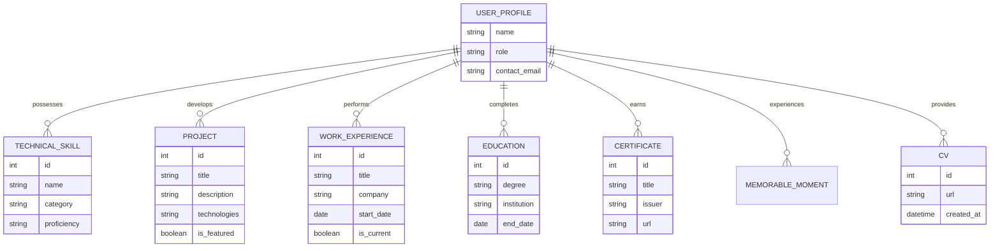

# AI Portfolio Platform


<div align="center">


</div>

An enterprise-grade, open-source platform designed to showcase professional achievements through an intelligent, context-aware AI interface. This system integrates a modern React frontend with a high-performance FastAPI backend, leveraging advanced Retrieval-Augmented Generation (RAG) and LangGraph for sophisticated agentic interactions.

---

## Table of Contents

- [Overview](#overview)
- [Key Features](#key-features)
- [System Architecture](#system-architecture)
- [AI Integration Flow](#ai-integration-flow)
- [Database Schema](#database-schema)
- [Project Structure](#project-structure)
- [Tech Stack](#tech-stack)
- [Getting Started](#getting-started)
  - [Prerequisites](#prerequisites)
  - [Installation](#installation)
  - [Environment Configuration](#environment-configuration)
- [Deployment](#deployment)
- [Contributing](#contributing)
- [Contact & Support](#contact--support)
- [License](#license)

---

## Overview

The AI Portfolio Platform is a full-stack solution I developed for developers and AI engineers to demonstrate their expertise. Unlike static portfolios, this platform features a dynamic AI agent that "knows" my professional history, projects, and skills, providing recruiters and collaborators with an interactive, data-driven experience.

---

## Key Features

- **Agentic AI Interface:** Powered by LangGraph and Google Gemini, providing context-aware, non-linear conversational experiences.
- **Advanced RAG Pipeline:** Implements FAISS for high-density vector storage and HuggingFace embeddings for semantic retrieval of professional data.
- **Enterprise Admin Suite:** A secure, JWT-authenticated dashboard for comprehensive management of projects, education, and work history.
- **Cloud-Native Storage:** Seamless integration with Supabase for resilient asset management and file hosting.
- **Observability & Logging:** Structured logging via `structlog` with real-time WebSocket streaming for system monitoring.
- **Containerized Orchestration:** Production-ready Docker Compose configuration for consistent deployment across environments.

---

## System Architecture

The following diagram illustrates the high-level architecture and data flow between the platform's core components.


---

## AI Integration Flow

The AI agent follows a multi-stage reasoning process to synthesize responses from the knowledge base.


---

## Database Schema

The relational schema is designed for extensibility and efficient querying of professional metadata.



---

## Project Structure

```text
ai-portfolio-platform/
├── backend/                # FastAPI Microservice
│   ├── ai_core/           # LangGraph Agents & RAG Logic
│   ├── api/               # REST Endpoints & Middleware
│   ├── models/            # SQLAlchemy Data Models
│   └── services/          # External Service Integrations
├── frontend/               # React SPA (Vite + TypeScript)
│   ├── src/
│   │   ├── components/    # Atomic UI Components
│   │   ├── pages/         # View Containers
│   │   └── services/      # API Clients
├── infrastructure/         # Nginx & Environment Configs
└── docker-compose.yml      # Service Orchestration
```

---

## Tech Stack

| Layer | Technologies |
| :--- | :--- |
| **Frontend** | React 18, TypeScript, Tailwind CSS, Vite |
| **Backend** | FastAPI, Python 3.12, SQLAlchemy, Pydantic |
| **AI/ML** | LangChain, LangGraph, Google Gemini 2.5 Flash, FAISS, HuggingFace |
| **Database** | PostgreSQL, Redis |
| **Infrastructure** | Docker, Nginx, Supabase, Sentry |

---

## Getting Started

### Prerequisites

- Docker Engine 24.0+ and Docker Compose
- Google Gemini API Key
- Supabase Project (URL and Service Key)

### Installation

1. **Clone the repository:**
   ```bash
   git clone https://github.com/dagiteferi/ai-portfolio-platform.git
   cd ai-portfolio-platform
   ```

2. **Configure environment variables:**
   Create a `.env` file in the root directory. Refer to `.env.example` for the required schema.

3. **Initialize services:**
   ```bash
   docker-compose up --build
   ```

The application will be accessible at `http://localhost`.

---

## Deployment

The platform is designed for containerized deployment. For production environments, it is recommended to:
- Use a managed PostgreSQL instance (e.g., RDS, Supabase DB).
- Configure SSL/TLS termination at the Nginx level.
- Implement a CI/CD pipeline for automated testing and deployment.

---

## Contributing

As the sole developer of this project, I welcome feedback and suggestions. If you would like to contribute or report an issue, please follow the standard fork-and-pull request workflow. I will review all submissions to ensure they align with the project's technical standards.

---

## Contact & Support

**Dagmawi Teferi**  
Sole Developer & Architect of the project 

- **Email:** [dagiteferi2011@gmail.com](mailto:dagiteferi2011@gmail.com)
- **LinkedIn:** [dagmawi-teferi](https://www.linkedin.com/in/dagmawi-teferi)
- **Telegram:** [@dagiteferi](https://t.me/dagiteferi)
- **GitHub:** [@dagiteferi](https://github.com/dagiteferi)

---

## License

This project is licensed under the MIT License. See the [LICENSE](LICENSE) file for details.
